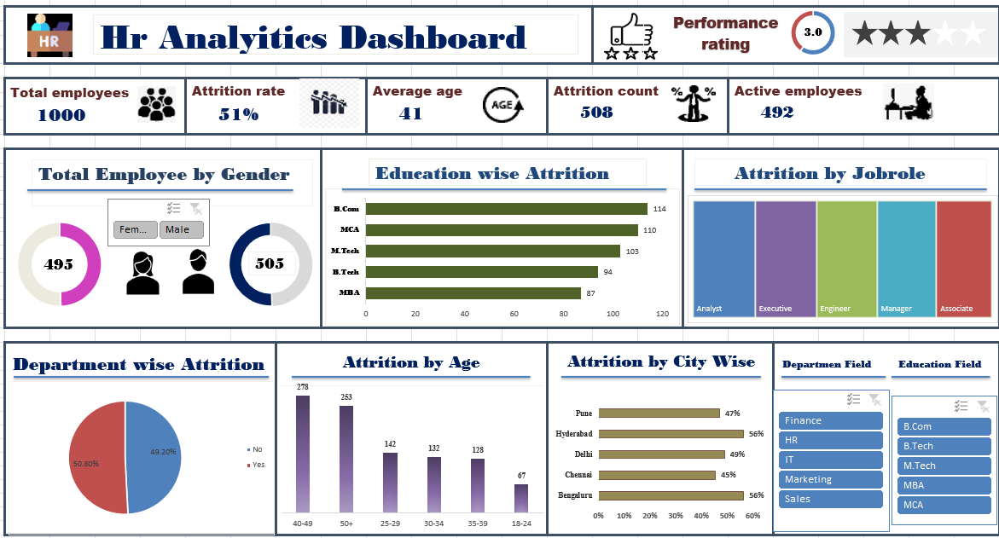

## HR Analytics Dashboard – Excel
# Project Overview
This project analyzes employee data in Microsoft Excel to understand employee attrition and workforce patterns across departments, cities, job roles, education levels, gender, and age groups.
The final output is an interactive HR Analytics Dashboard built using Excel Tables, formulas, PivotTables, PivotCharts, KPI cards, and slicers.
Dashboard Output

Dashboard highlights:
- Total Employees
- Attrition Rate
- Average Age
- Attrition Count
- Active Employees
- Gender analysis
- Education-wise attrition
- Job-role analysis
- Department-wise attrition
- Age-wise attrition
- City-wise attrition
- Department and Education slicers
Key KPIs
KPI	Value
Total Employees	1,000
Attrition Count	508
Active Employees	492
Attrition Rate	50.8%
Average Age	41

Business Problem
HR teams need a clear way to understand employee attrition and identify workforce segments with relatively higher attrition. Raw employee records need cleaning, validation, summarization, and visualization before they can support HR decision-making.

# Objectives
- Clean and standardize employee data.
- Validate missing and invalid values.
- Calculate key HR KPIs.
- Analyze attrition across departments, cities, job roles, education, gender, and age groups.
- Build an interactive Excel dashboard.
- Identify areas that HR should investigate further.
Workflow
Raw Data → Cleaning → Validation → Standardization → Helper Columns → PivotTables → PivotCharts → Slicers → KPI Cards → Dashboard → Insights
Excel Skills Used
- Excel Tables
- IF, COUNTIF, COUNTIFS and related formulas
- Data cleaning and standardization
- PivotTables
- PivotCharts
- Slicers
- KPI cards
- Conditional formatting
- Data visualization
- GETPIVOTDATA / PivotTable-linked metrics
  
  ## Hr Dashboard
  

# Data Cleaning

The project included:
- Missing-value checks
- Duplicate/ID validation
- Negative salary validation
- Standardization of city and department names
- Standardization of education, gender, and job-role values
- Conversion of the cleaned source data into an Excel Table
  
# Important Analytical Rule
Department Attrition Rate = Employees with Attrition = Yes in that department ÷ Total employees in that department
This is different from % of Grand Total.

# Business Conclusion
The dataset shows relatively high overall attrition and variation across different workforce segments. The dashboard helps identify departments, cities, age groups, education groups, and job roles that deserve closer investigation.
The dashboard is descriptive, not proof of causation. For example, a department with higher attrition should be investigated further rather than automatically being considered the cause of attrition.
Potential factors for deeper analysis include:
- Salary
- Overtime
- Job role
- Experience/tenure
- Performance
- Age
- Department
- Location

# Future Improvements
- Automate cleaning with Power Query.
- Build a Power Pivot/Data Model.
- Create DAX measures.
- Rebuild the dashboard in Power BI.
- Add deeper attrition-driver analysis.
Repository Structure
HR-Analytics-Excel/
├── README.md
├── HR_Analytics_Final_Project.xlsx
├── docs/
│   ├── HR_Analytics_Problem_Statement.pdf
│   ├── HR_Analytics_Excel_Practice_20_Questions.pdf
│   └── HR_Analytics_Final_Project_Document.pdf
└── screenshots/
    └── dashboard.png
Author
Balyala Tharun
Data Analyst | Excel | SQL | Python | Power BI
